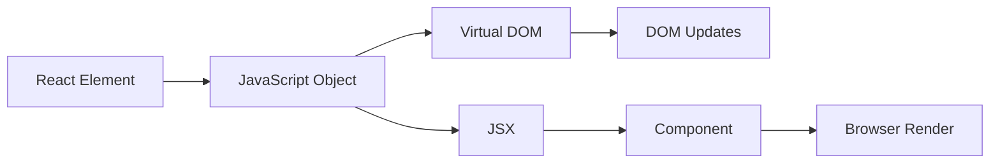

# Babel

1. To skip the process of using **npx** , we can instead intorduce scripts inside our ***package.json*** instead to use them using npm. Following lines are added under the script object
```
    "start": "parcel index.html",
    "build": "parcel build index.html"
```
and we use **npm run start** to start the project and **npm run build** to build the project.<br><br>
2. **React Element** is basically a Javascript Object and not a HTMl Object , so behind the scene , React Element is first converted into a js object and then it is rendered to the HTML where we are able to see that in the browser view.

